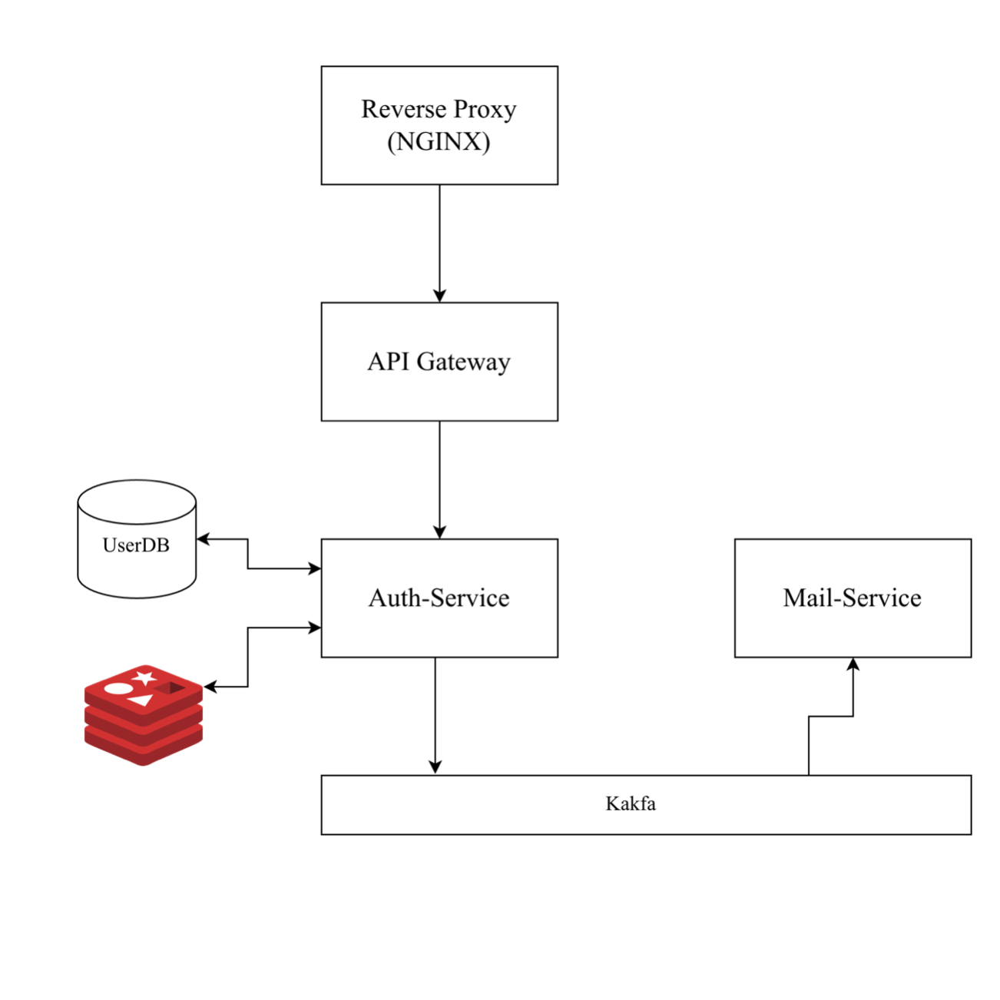

# Verification System

A microservices based application demonstrating a clean and scalable architecture.

## Architecture & Flow

This system is built using an API Gateway pattern with asynchronous event-driven communication:

*   **API Gateway**: Acts as the single entry point for the application. It uses **Spring Cloud** to dynamically route incoming requests to the appropriate backend services. Static routing or load balancing may be further handled by **Nginx**.
*   **Auth Service**: The API Gateway directs user-related requests to the Auth Service, where all login and registration operations actually happen.
*   **Asynchronous Processing with Kafka**: When a user registers, the Auth Service (acting as a Kafka producer) triggers a sign-up event. This event is consumed asynchronously so that emails are sent out without blocking the main registration flow. 
*   **Redis Storage**: Redis is utilized as an in-memory storage to quickly store and manage data for unregistered users or pending registrations.

## Key Features

*   **JWT Token Login**: Secure, stateless authentication utilizing JSON Web Tokens.
*   **Async Login Features**: Seamless and non-blocking authentication flows.
*   **Event-Driven Communication**: Apache Kafka is used to decouple services and handle background tasks seamlessly.
*   **High-Speed Caching**: Redis integration for handling transient state.

## Architecture Diagram

